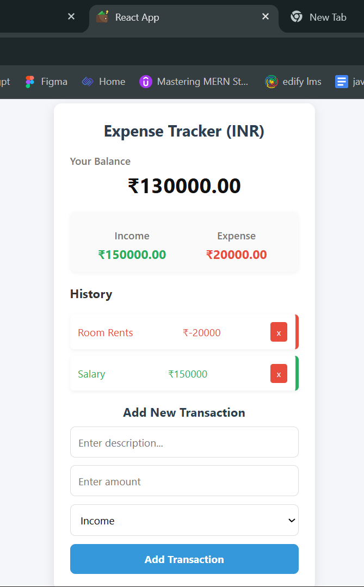

# 💰 Expense Tracker  

The **Expense Tracker** is a simple and responsive web app built with **React**.  
It allows users to add income and expenses, view their transaction history, and track their balance in real-time.  
The app uses **Context API** and **useReducer** for state management, making it efficient and avoiding prop drilling.  

---

## ✨ Features  
- Add transactions as **income** or **expense**  
- Calculate **total balance** dynamically  
- View **income and expense totals** separately  
- Delete transactions easily  
- Clean and responsive UI  

---

## 🛠 Tech Stack  
- **React** (Functional Components + Hooks)  
- **Context API** + **useReducer** for global state  
- **CSS** for styling and responsiveness  

---

## 📖 How It Works  
1. User enters a transaction (text + amount).  
2. If the amount is **positive**, it’s counted as **Income**.  
3. If the amount is **negative**, it’s counted as **Expense**.  
4. The balance updates automatically based on the transactions.  
5. Transactions can be **deleted** any time.  

---

## 🎯 Project Goal  
The goal of this project is to learn:  
- React state management with Context API  
- Reducer functions for handling actions  
- Building a responsive UI without external APIs  

---

## 👀 Example Use Case  
- Income: `+5000` (Salary)  
- Expense: `-1200` (Groceries)  
- Balance: `3800`  

